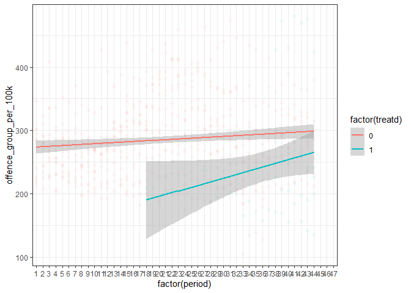

This is how we did it
================
James Currer
2024-07-08

## Including Plots

You can also embed plots, for example this one looking at Criminal
damage and arson:

    ## Warning: Removed 39 rows containing non-finite values (`stat_smooth()`).

    ## Warning: Removed 39 rows containing missing values (`geom_point()`).

<!-- -->

Note that the `echo = FALSE` parameter was added to the code chunk to
prevent printing of the R code that generated the plot.
